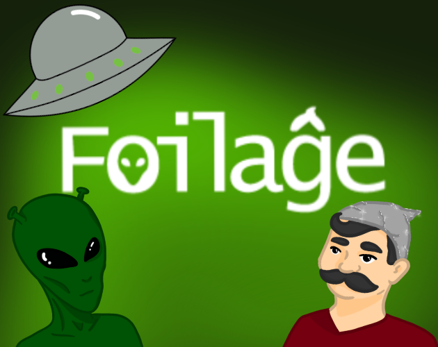
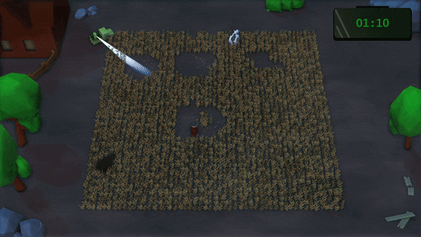

<h1 align="center"><b>Foilaĝe</b></h3>

  

## What is it?
This is a fork of a custom game engine and contains code of a "Komiks Game Jam 2k25" game (and engine) "Foilaĝe".
For more info about the engine and its origin, please check the [<b>original repository under this link</b>](https://github.com/0GreenClover0/Engine).

## Story
**You're a truther.** And you know that **aliens exist**. 👽 Everyone knows that. You just need to convince them a little. So you **make crazy symbols in wheat** yourself!

However, not everyone is happy with it. Some **suspicious cows** or **a farm owner**, for instance... Will you create the symbols against the odds?

  

## Game Creators
| Name | Link | Role |
|------|--------|--------|
| Mikołaj Przybylski | https://github.com/0GreenClover0| Programming Lead |
| Michał Galiński | https://github.com/MikeMG-PL| Programming, Production |
| Miłosz Kawczyński | https://github.com/MiloszKawczynski | Programming, Design |
| Karolina Sołtysiak | https://github.com/dramatiCatt | 2D & 3D Art |
| Michał Świstak | https://soundcloud.com/michal_swistak | Sound Design |

## Engine Programmers
| Name | Link |
|------|--------|
| Mikołaj Przybylski | https://github.com/0GreenClover0|
| Hubert Olejnik | https://github.com/umbc1ok |
| Miłosz Kawczyński  | https://github.com/MiloszKawczynski
| Michał Galiński | https://github.com/MikeMG-PL|